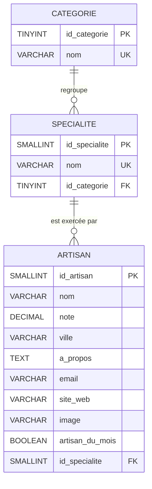

# Base de données - Trouve ton artisan

## 1. Règles de gestion

Les règles issues du cahier des charges structurent tout le modèle :

- **RG1** : un artisan apparaît dans une seule spécialité.
- **RG2** : une spécialité est rattachée à une seule catégorie.
- **RG3** : une catégorie regroupe plusieurs spécialités.
- **RG4** : une spécialité peut être exercée par plusieurs artisans.
- **RG5** : la note d'un artisan est comprise entre 0 et 5, avec une décimale.
- **RG6** : un artisan peut ne pas avoir de site web.
- **RG7** : un artisan peut être mis en avant comme « artisan du mois ».

## 2. Dictionnaire des données

| Entité | Propriété | Type logique | Type physique | Contraintes | Description |
|---|---|---|---|---|---|
| Categorie | id_categorie | Entier | TINYINT UNSIGNED | Clé primaire, auto-incrément | Identifiant de la catégorie |
| Categorie | nom | Texte 50 | VARCHAR(50) | Non nul, unique | Libellé affiché dans le menu |
| Specialite | id_specialite | Entier | SMALLINT UNSIGNED | Clé primaire, auto-incrément | Identifiant de la spécialité |
| Specialite | nom | Texte 50 | VARCHAR(50) | Non nul, unique | Libellé du métier |
| Specialite | id_categorie | Entier | TINYINT UNSIGNED | Clé étrangère, non nul | Catégorie de rattachement |
| Artisan | id_artisan | Entier | SMALLINT UNSIGNED | Clé primaire, auto-incrément | Identifiant de l'artisan |
| Artisan | nom | Texte 100 | VARCHAR(100) | Non nul, indexé | Nom de l'artisan ou de l'entreprise |
| Artisan | note | Décimal | DECIMAL(2,1) | Non nul, entre 0 et 5 | Note sur cinq |
| Artisan | ville | Texte 100 | VARCHAR(100) | Non nul | Localisation |
| Artisan | a_propos | Texte long | TEXT | Nullable | Présentation de l'artisan |
| Artisan | email | Texte 255 | VARCHAR(255) | Non nul | Destinataire du formulaire de contact |
| Artisan | site_web | Texte 255 | VARCHAR(255) | Nullable | Site de l'artisan le cas échéant |
| Artisan | image | Texte 255 | VARCHAR(255) | Nullable | Visuel de la fiche |
| Artisan | artisan_du_mois | Booléen | BOOLEAN | Non nul, défaut faux | Mise en avant sur l'accueil |
| Artisan | id_specialite | Entier | SMALLINT UNSIGNED | Clé étrangère, non nul | Spécialité exercée |

### Deux écarts assumés par rapport au fichier client

1. **Colonne `image`** : absente du fichier fourni, mais le cahier des charges impose une image sur la fiche artisan. Elle est donc ajoutée en nullable. Tant qu'elle vaut NULL, le front affiche l'illustration générique de la spécialité.
2. **Colonne `artisan_du_mois`** : correspond à la colonne « Top » du fichier, renommée pour être auto-documentée.

## 3. MCD (Modèle Conceptuel de Données)

Formalisme Merise, avec les cardinalités :

```
    ┌──────────────────┐
    │    CATEGORIE     │
    ├──────────────────┤
    │ id_categorie     │
    │ nom              │
    └────────┬─────────┘
             │ (1,n)
        ╱────┴────╲
       ╱ APPARTENIR ╲
        ╲──────────╱
             │ (1,1)
    ┌────────┴─────────┐
    │    SPECIALITE    │
    ├──────────────────┤
    │ id_specialite    │
    │ nom              │
    └────────┬─────────┘
             │ (1,n)
        ╱────┴────╲
       ╱  EXERCER  ╲
        ╲──────────╱
             │ (1,1)
    ┌────────┴─────────┐
    │     ARTISAN      │
    ├──────────────────┤
    │ id_artisan       │
    │ nom              │
    │ note             │
    │ ville            │
    │ a_propos         │
    │ email            │
    │ site_web         │
    │ image            │
    │ artisan_du_mois  │
    └──────────────────┘
```

Lecture des cardinalités :

- Une catégorie regroupe **1 à n** spécialités ; une spécialité appartient à **une et une seule** catégorie.
- Une spécialité est exercée par **1 à n** artisans ; un artisan exerce **une et une seule** spécialité.

Les deux associations sont de type **1:N**. Aucune association N:N, donc aucune table de liaison n'est nécessaire.

## 4. MLD (Modèle Logique de Données)

Les associations 1:N se traduisent par la migration de la clé primaire du côté « 1 » vers la table du côté « N » :

```
CATEGORIE  (id_categorie, nom)

SPECIALITE (id_specialite, nom, #id_categorie)
             #id_categorie → CATEGORIE.id_categorie

ARTISAN    (id_artisan, nom, note, ville, a_propos, email,
            site_web, image, artisan_du_mois, #id_specialite)
             #id_specialite → SPECIALITE.id_specialite
```

Représentation relationnelle :



## 5. MPD (Modèle Physique de Données)

Le modèle physique est le fichier [`database/01-create-database.sql`](../database/01-create-database.sql). Choix retenus :

| Choix | Justification |
|---|---|
| Moteur InnoDB | Seul moteur MySQL/MariaDB à gérer réellement les clés étrangères et les transactions. |
| utf8mb4_unicode_ci | Gère les accents et les caractères spéciaux, comparaisons insensibles à la casse et aux accents pour la recherche. |
| `DECIMAL(2,1)` pour la note | Évite les erreurs d'arrondi du flottant sur une valeur affichée telle quelle. |
| `CHECK (note BETWEEN 0 AND 5)` | Applique la RG5 au niveau du SGBD, donc même hors application. |
| `ON DELETE RESTRICT` | Interdit de supprimer une catégorie ou une spécialité encore utilisée, ce qui empêche les enregistrements orphelins. |
| Index sur `nom`, `id_specialite`, `id_categorie`, `artisan_du_mois` | Couvrent les trois requêtes du site : recherche par nom, filtrage par catégorie, artisans du mois. |
| Types entiers dimensionnés au plus juste | `TINYINT` pour 4 catégories, `SMALLINT` pour les spécialités et artisans : moins d'espace disque et d'index. |

## 6. Jeu d'essai

Le script [`database/02-seed-database.sql`](../database/02-seed-database.sql) alimente la base avec les données du client, puis exécute quatre requêtes de contrôle dont les résultats attendus sont documentés en commentaire :

| Contrôle | Résultat attendu | Résultat obtenu |
|---|---|---|
| Comptage des lignes | 4 catégories, 15 spécialités, 17 artisans | Conforme |
| Artisans du mois | 3 (Au pain chaud, Chocolaterie Labbé, Orville Salmons) | Conforme |
| Répartition par catégorie | Alimentation 4, Bâtiment 4, Fabrication 3, Services 6 | Conforme |
| Notes hors bornes | Aucune ligne | Conforme |

## 7. Installation

```bash
mysql -u root -p --default-character-set=utf8mb4 < database/01-create-database.sql
mysql -u root -p --default-character-set=utf8mb4 < database/02-seed-database.sql
```

Le premier script crée également l'utilisateur applicatif `tta_app`, limité au seul `SELECT` sur les trois tables. C'est ce compte, et non `root`, que l'API utilise pour se connecter.

## 8. Évolution du schéma

Le cahier des charges annonce que la base « sera, à terme, alimentée par une application qui sera réalisée ultérieurement ». Deux évolutions sont déjà prévisibles : cette application devra savoir quand une fiche a été modifiée, et la colonne `image`, aujourd'hui vide faute de visuels dans le jeu d'essai, recevra de vraies adresses, souvent plus longues que les 255 caractères actuels.

Ces changements se font par `ALTER TABLE`, sans toucher aux données déjà en place :

```sql
-- Création d'une colonne : horodatage tenu par le SGBD lui-même.
ALTER TABLE artisan
    ADD COLUMN modifie_le TIMESTAMP NOT NULL
        DEFAULT CURRENT_TIMESTAMP ON UPDATE CURRENT_TIMESTAMP
        COMMENT 'Date de la dernière modification de la fiche';

-- Modification d'une colonne existante : allongement du format.
ALTER TABLE artisan
    MODIFY COLUMN image VARCHAR(512) NULL;

-- Suppression d'une colonne devenue inutile.
ALTER TABLE artisan
    DROP COLUMN modifie_le;
```

Deux précautions valent d'être notées.

`MODIFY COLUMN` réécrit la définition entière : omettre `NULL` la rendrait obligatoire et ferait échouer l'instruction sur les dix-sept lignes dont `image` est vide. La définition se redonne donc en entier, jamais partiellement.

Les clés étrangères sont déclarées `ON DELETE RESTRICT` : supprimer une catégorie encore rattachée à une spécialité, ou une spécialité encore exercée par un artisan, est refusé par le SGBD. C'est voulu, cela empêche les enregistrements orphelins. Une réorganisation des catégories suppose donc de réaffecter les spécialités d'abord, et non de forcer la suppression.
